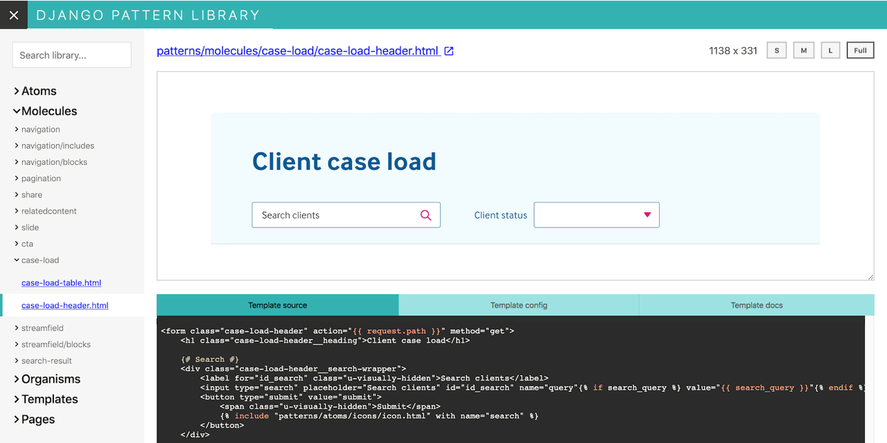

# Django pattern library

[](https://pypi.org/project/django-pattern-library/) [](https://pypi.org/project/django-pattern-library/) [](https://travis-ci.com/torchbox/django-pattern-library) [](https://lgtm.com/projects/g/torchbox/django-pattern-library/alerts/) [](https://lgtm.com/projects/g/torchbox/django-pattern-library/context:python)

A module for Django that helps you to build pattern libraries and follow the
[Atomic design](http://bradfrost.com/blog/post/atomic-web-design/) methodology.



## Objective

At the moment, the main focus is to allow developers and designers
use exactly the same Django templates in a design pattern library
and in production code.

There are a lot of alternative solutions for building
pattern libraries already. Have a look at [Pattern Lab](http://patternlab.io/) and
[Astrum](http://astrum.nodividestudio.com/), for example.
But at [Torchbox](https://torchbox.com/) we mainly use Python and Django and
we find it hard to maintain layout on big projects in several places:
in a project's pattern library and in actual production code. This is our
attempt to solve this issue and reduce the amount of copy-pasted code.

## Documentation

Documentation is located [here](./docs).

## How to install

1. Add `pattern_library` into your `INSTALLED_APPS`:

   ```python
   INSTALLED_APPS = [
       # ...

       'pattern_library',

       # ...
   ]
   ```

2. Add `pattern_library.loader_tags` into the `TEMPLATES` setting. For example:

   ```python
   TEMPLATES = [
       {
           'BACKEND': 'django.template.backends.django.DjangoTemplates',
           'DIRS': [],
           'APP_DIRS': True,
           'OPTIONS': {
               'context_processors': [
                   'django.template.context_processors.debug',
                   'django.template.context_processors.request',
                   'django.contrib.auth.context_processors.auth',
                   'django.contrib.messages.context_processors.messages',
               ],
               'builtins': ['pattern_library.loader_tags'],
           },
       },
   ]
   ```

   Note that this module only supports the Django template backend out of the box.

3. Set the `PATTERN_LIBRARY_TEMPLATE_DIR` setting to point to a template directory with your patterns:

   ```python
   PATTERN_LIBRARY_TEMPLATE_DIR = os.path.join(BASE_DIR, 'project_styleguide', 'templates')
   ```

   Note that `PATTERN_LIBRARY_TEMPLATE_DIR` must be available for
   [template loaders](https://docs.djangoproject.com/en/1.11/ref/templates/api/#loader-types).

4. Include `pattern_library.urls` into your `urlpatterns`. Here's an example `urls.py`:

    ```python
    from django.apps import apps
    from django.conf.urls import url, include


    urlpatterns = [
        # ... Your URLs
    ]

    if apps.is_installed('pattern_library'):
        urlpatterns += [
            url(r'^pattern-library/', include('pattern_library.urls')),
        ]
    ```

## Developer docs

Developer docs can be found [here](./docs/dev_process.md).
