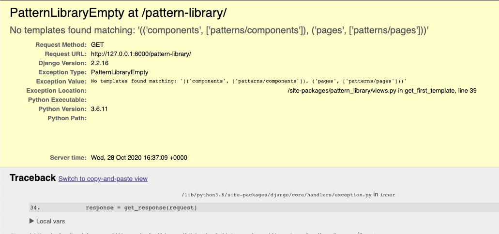

# Getting started

> If you just want to see django-pattern-library up and running, have a look at our [online demo](https://torchbox.github.io/django-pattern-library/demo/pattern-library/pattern/patterns/molecules/accordion/accordion.html).

## Installation

django-pattern-library is available [on PyPI](https://pypi.org/project/django-pattern-library/). First install it in your Django project:

```sh
# With pip,
pip install django-pattern-library
# Alternatively, with Poetry,
poetry add --dev django-pattern-library
```

### Compatibility

We support:

- Django 2.2.x, 3.0.x, 3.1.x, 3.2.x, 4.0.x (experimental)
- Python 3.6, 3.7, 3.8, 3.9
- Django Templates only, no Jinja support

## Configuration

### Django settings

In your Django settings file, add `pattern_library` to `INSTALLED_APPS`:

```python
INSTALLED_APPS = [
    # ...
    "pattern_library",
    # ...
]
```

Also add `pattern_library.loader_tags` to `OPTIONS["builtins"]` into the `TEMPLATES` setting:

```python hl_lines="13 14 15"
TEMPLATES = [
    {
        "BACKEND": "django.template.backends.django.DjangoTemplates",
        "DIRS": [],
        "APP_DIRS": True,
        "OPTIONS": {
            "context_processors": [
                "django.template.context_processors.debug",
                "django.template.context_processors.request",
                "django.contrib.auth.context_processors.auth",
                "django.contrib.messages.context_processors.messages",
            ],
            "builtins": [
                "pattern_library.loader_tags"
            ],
        },
    },
]
```

### Pattern library settings

Still in Django settings, set the [`PATTERN_LIBRARY`](./reference/api.md#pattern_library) setting. Here is an example showing the defaults:

```python
PATTERN_LIBRARY = {
    # Groups of templates for the pattern library navigation. The keys
    # are the group titles and the values are lists of template name prefixes that will
    # be searched to populate the groups.
    "SECTIONS": (
        ("components", ["patterns/components"]),
        ("pages", ["patterns/pages"]),
    ),

    # Configure which files to detect as templates.
    "TEMPLATE_SUFFIX": ".html",

    # Set which template components should be rendered inside of,
    # so they may use page-level component dependencies like CSS.
    "PATTERN_BASE_TEMPLATE_NAME": "patterns/base.html",

    # Any template in BASE_TEMPLATE_NAMES or any template that extends a template in
    # BASE_TEMPLATE_NAMES is a "page" and will be rendered as-is without being wrapped.
    "BASE_TEMPLATE_NAMES": ["patterns/base_page.html"],
}
```

Note the templates in your [`PATTERN_LIBRARY`](./reference/api.md#pattern_library) settings must be available to [template loaders](https://docs.djangoproject.com/en/3.1/ref/templates/api/#loader-types).

### URLs

Include `pattern_library.urls` in your `urlpatterns`. Here is an example `urls.py`:

```python
from django.apps import apps
from django.urls import include, path

urlpatterns = [
    # … Your URLs
]

if apps.is_installed("pattern_library"):
    urlpatterns += [
        path("pattern-library/", include("pattern_library.urls")),
    ]
```

!!! warning "Security"

    This package isn’t intended for production usage, and hasn’t received extensive security scrutiny.

It is **highly recommended** to only enable this package in testing environments, for a restricted, trusted audience. One way to do this is to only expose its URLs if `apps.is_installed("pattern_library")`, as demonstrated above, and only have the app installed in environment-specific settings.

---

Alright, now that we got this far, we can navigate to `http://localhost:8000/pattern-library/` to see our pattern library! But if we tried to do this now, we would likely get a `PatternLibraryEmpty` error – this is expected, as we haven’t added any patterns yet.



Now let’s look at adding our first template!

## First pattern

Now we’ve done all of the configuration – let’s create a UI component. We’ll use `quote-block` as an example, and place it at `patterns/components/quote_block/quote_block.html` inside one of our Django apps:

```jinja2
<blockquote class="quote-block block--spacing">
    <div class="quote-block__text">
        <p class="quote-block__quote">{{ quote }}</p>
        
            <p class="quote-block__attribution">{{ attribution }}</p>
        
    </div>
</blockquote>
```

### Base template

We additionally need to customize a base template, so the standalone component can be rendered within a page with CSS. This is what the `PATTERN_BASE_TEMPLATE_NAME` setting is for. As a separate template in `patterns/base.html`:

```jinja2 hl_lines="11"
<!DOCTYPE html>
<html lang="en">
<head>
  <meta charset="UTF-8">
  <meta name="viewport" content="width=device-width, initial-scale=1.0">
  <title>My Base</title>
</head>
<body>
  
    {# pattern_library_rendered_pattern is where the pattern library will inject the rendered pattern. #}
    {{ pattern_library_rendered_pattern }}
  
</body>
</html>
```

`quote_block` should now appear in the pattern library UI menu! But the template doesn’t display anything – we additionally need to provide it with test data.

### Component data

We can provide context and tags overrides for our new component by creating a `quote_block.yaml` YAML file alongside the HTML, at `patterns/components/quote_block/quote_block.yaml` in our example.

```yaml
context:
  quote: What is love?
  attribution: Haddaway
```

We could also provide it with a custom name:

```yaml
name: Quote Block
context:
  quote: What is love?
  attribution: Haddaway
```

And that’s it! Our `quote_block` should finally appear in the pattern library, along with its rendering with this mock data.


