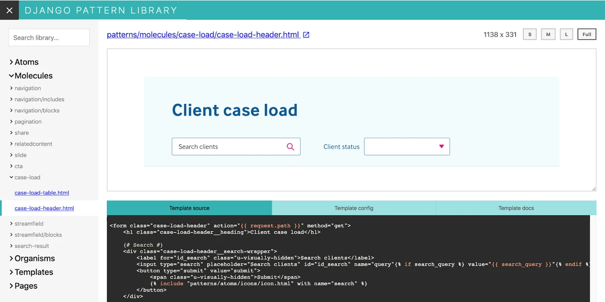

# Django pattern library

> UI pattern libraries for Django templates

## Features

The [django-pattern-library](https://pypi.org/project/django-pattern-library/) package automates the maintenance of UI pattern libraries or styleguides for Django projects, and allows developers to experiment with Django templates without having to create Django views and models.

- Create reusable patterns by creating Django templates files as usual.
- All patterns automatically show up in the pattern library’s interface.
- Define data as YAML files for the templates to render with the relevant Django context.
- Override Django templates tags as needed to mock the template’s dependencies.
- Document your patterns with Markdown.

Here is a screenshot of the pattern library in action:

## Why you need this

Pattern libraries will change your workflow for the better:

- They help separate concerns, both in code, and between members of a development team.
- If needed, they make it possible for UI development to happen before models and views are created.
- They encourage code reuse – defining independent UI components, that can be reused across apps, or ported to other projects.
- It makes it much simpler to test UI components – no need to figure out where they’re used across a site or app.

## Online demo

The pattern library is dependent on Django for rendering – but also supports exporting as a static site if needed. Try out our online demo:

- For a component, [accordion.html](https://torchbox.github.io/django-pattern-library/demo/pattern-library/pattern/patterns/molecules/accordion/accordion.html)
- For a page-level template, [person_page.html](https://torchbox.github.io/django-pattern-library/demo/pattern-library/pattern/patterns/pages/people/person_page.html)

## Why this exists

We want to make it possible for developers to maintain large pattern libraries with minimal fuss – no copy-pasting of templates between a static library and the “production” templates.

There are a lot of alternative solutions for building pattern libraries, or to have [UI development playgrounds](https://www.componentdriven.org/).
At [Torchbox](https://torchbox.com/) we mainly use Django and Wagtail, and we found it hard to maintain large libraries with those tools that have no awareness of Django Templates.
This is our attempt to solve this issue – [Pattern Lab](http://patternlab.io/) goes Django!

To learn more about how this package can be used, have a look at our talk:

[Reusable UI components: A journey from React to Wagtail](https://www.youtube.com/watch?v=isrOufI7TKc)

